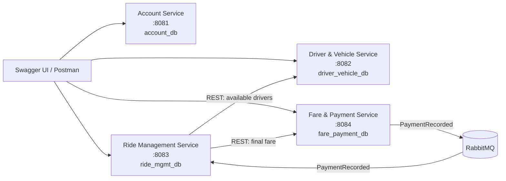

# RideLink Architecture

Each service owns its database. Services exchange UUID references only and never read or write another service's data store.

Driver & Vehicle answers who is available; Ride Management decides who is assigned. Fare & Payment owns money records; Ride Management owns the ride lifecycle.
