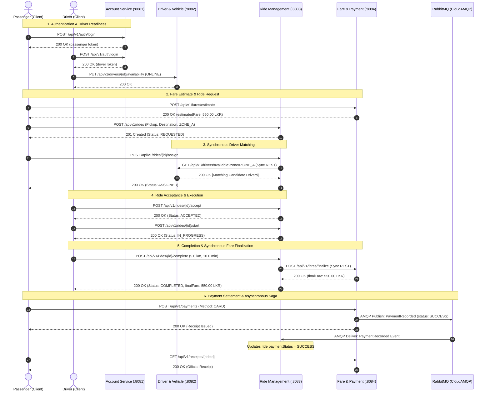

# IT3130 — Application Development | Technical Report

---

# 1. Title Page

**RideLink: A Distributed Backend Microservices Architecture for a Ride-Sharing Platform**

**Institution:** Sri Lanka Institute of Information Technology (SLIIT)  
**Faculty:** Faculty of Computing — Department of Information Technology  
**Module:** IT3130 — Application Development (Year 3, Semester 1)  
**Assessment:** Group Assignment (Weight: 30% of Module Total)  
**Academic Year / Semester:** 2026 / Y3S1  
**Group Identification:** Group XX *(Replace with assigned Group ID)*  
**Repository Release Tag:** `v1.0.0-final-submission`  
**Date of Submission:** October 2026  

### Service Ownership & Group Identification Table

| Member No. | Student Full Name | Student Registration No. (IT No.) | Assigned Microservice Ownership | Port & Assigned Database |
| :---: | :--- | :---: | :--- | :--- |
| **Member 1** | *[Student 1 Full Name]* | *[IT Number 1]* | **Account & Identity Service** | Port `8081` \| `account_db` |
| **Member 2** | *[Student 2 Full Name]* | *[IT Number 2]* | **Driver & Vehicle Service** | Port `8082` \| `driver_vehicle_db` |
| **Member 3** | *[Student 3 Full Name]* | *[IT Number 3]* | **Ride Management Service** | Port `8083` \| `ride_mgmt_db` |
| **Member 4** | *[Student 4 Full Name]* | *[IT Number 4]* | **Fare & Payment Service** | Port `8084` \| `fare_payment_db` |

---

# 2. Introduction

RideLink is a fictional, enterprise-grade backend ride-sharing platform inspired by modern on-demand mobility systems such as Uber and PickMe. Designed to support high operational velocity, clear business encapsulation, and horizontal scalability, the system decomposes core ride-booking capabilities into four independently executable Spring Boot microservices: Account Service, Driver & Vehicle Service, Ride Management Service, and Fare & Payment Service. In strict accordance with the assignment brief (§6.5), the platform is developed under a **backend-only scope**; no web or mobile frontend was built or required. Instead, each microservice exposes interactive OpenAPI 3.0 (Swagger UI) interfaces, and end-to-end integration workflows are verified, automated, and demonstrated using a shared, environment-driven Postman test collection.

---

# 3. Architecture & Service Decomposition (G1)

### 3.1 Architecture & Service Decomposition

The RideLink platform applies Domain-Driven Design (DDD) principles to decompose the ride-sharing problem space into four cohesive, loosely coupled bounded contexts:

1. **Account & Identity Service (`:8081`):** Governs user identity, credential security, role-based access control (RBAC), and authentication token lifecycles.
2. **Driver & Vehicle Service (`:8082`):** Manages driver operational readiness, vehicle technical specifications, real-time simulated location telemetry, and candidate driver availability.
3. **Ride Management Service (`:8083`):** Functions as the central workflow orchestrator, managing ride bookings, automated candidate discovery, state machine transitions, and trip history.
4. **Fare & Payment Service (`:8084`):** Governs financial computations, upfront trip estimates, final fare calculations, simulated payment settlements, immutable receipts, and event publishing.

```mermaid
flowchart TB
    subgraph Clients["Supported Demonstration Clients (§6.5)"]
        Swagger["Swagger UI Documentation\n(:8081, :8082, :8083, :8084)"]
        Postman["Automated Postman Collection\n(RideLink Local Environment)"]
    end

    subgraph Service1["Member 1: Account Service (:8081)"]
        AccCtrl["AccountController"]
        AccSvc["AccountService"]
        AccDB[(MongoDB: account_db)]
        AccCtrl --> AccSvc --> AccDB
    end

    subgraph Service2["Member 2: Driver & Vehicle Service (:8082)"]
        DrvCtrl["DriverController"]
        DrvSvc["DriverService"]
        DrvDB[(MongoDB: driver_vehicle_db)]
        DrvCtrl --> DrvSvc --> DrvDB
    end

    subgraph Service3["Member 3: Ride Management Service (:8083)"]
        RideCtrl["RideController"]
        RideSvc["RideService (Orchestrator)"]
        RideListener["PaymentRecordedListener"]
        RideDB[(MongoDB: ride_mgmt_db)]
        RideCtrl --> RideSvc --> RideDB
        RideListener --> RideSvc
    end

    subgraph Service4["Member 4: Fare & Payment Service (:8084)"]
        FareCtrl["FareController"]
        FareSvc["FareService"]
        FarePublisher["RabbitTemplate"]
        FareDB[(MongoDB: fare_payment_db)]
        FareCtrl --> FareSvc --> FareDB
        FareSvc --> FarePublisher
    end

    subgraph Broker["CloudAMQP Message Broker"]
        Exchange["Exchange: ridelink.payment\n(topic)"]
        Queue["Queue: ride.payment.recorded\n(durable)"]
        Exchange -->|routingKey: payment.recorded| Queue
    end

    Clients -->|HTTP REST + Bearer JWT| AccCtrl
    Clients -->|HTTP REST + Bearer JWT| DrvCtrl
    Clients -->|HTTP REST + Bearer JWT| RideCtrl
    Clients -->|HTTP REST + Bearer JWT| FareCtrl

    RideSvc -.->|Sync REST: GET /drivers/available?zone=X\n(Bearer Token Forwarded)| DrvCtrl
    RideSvc -.->|Sync REST: POST /fares/finalize\n(Bearer Token Forwarded)| FareCtrl

    FarePublisher ==>|AMQP Publish: PaymentRecorded| Exchange
    Queue ==>|AMQP Consume: PaymentRecorded| RideListener
```

#### Explicit Data-Ownership & Boundary Statement
In strict compliance with §6.1, **every microservice maintains exclusive ownership over its own persistence boundary**. The team configured a single MongoDB Atlas cluster partitioned into four completely separate logical databases: `account_db`, `driver_vehicle_db`, `ride_mgmt_db`, and `fare_payment_db`. Each database is accessed exclusively through a dedicated, role-scoped Atlas user credential (`account_user`, `driver_vehicle_user`, `ride_mgmt_user`, `fare_payment_user`). **No service is permitted to read, write, or join tables/collections belonging to another service.** Entities across boundaries are linked exclusively through immutable, globally unique string UUIDs (e.g., `userId`, `driverId`, `rideId`).

Furthermore, the team established two definitive architectural contracts to prevent overlap:
- **Operational vs. Allocative Boundary:** *Driver & Vehicle Service answers "who is available"; Ride Management Service decides "who is assigned."* Member 2 maintains driver readiness; Member 3 runs allocation algorithms.
- **Monetary vs. State Boundary:** *Fare & Payment Service owns monetary calculation and settlement; Ride Management Service owns ride lifecycle state.* Member 4 never mutates ride state directly; Member 3 updates payment state upon receiving verified event messages.

#### Monolith vs. Microservices Comparison
To justify the architectural decomposition, the team evaluated the selected microservices architecture against a traditional monolithic Spring Boot application:

| Evaluation Dimension | Monolithic Architecture | RideLink Microservices Architecture | Architectural Rationale for RideLink |
| :--- | :--- | :--- | :--- |
| **Deployment Independence** | All domains packaged into a single executable JAR; any change requires redeploying the entire platform. | Each of the 4 microservices is built, tested, and deployed as an independent container/process. | Driver location updates and ride orchestration experience high feature churn without risking account authentication. |
| **Fault Isolation** | Memory leaks or crashes in fare calculations bring down identity, booking, and driver tracking. | Failures are confined within process boundaries. | A transient crash in payment settlement does not prevent active drivers from accepting or starting rides. |
| **Scalability & Resource Profiles** | Uniform scaling of the entire monolith, wasting compute resources. | Independent horizontal scaling based on domain traffic. | Driver location ingestion requires high I/O throughput; account registration has low, steady throughput. |
| **Data Decoupling** | Temptation to execute cross-table relational joins, creating tight data schema coupling. | Bounded contexts with private databases per service (`account_db`, `ride_mgmt_db`, etc.). | Guarantees compliance with Domain-Driven Design (DDD) and allows independent schema evolution. |
| **Operational Complexity** | Simple local development; zero interprocess network latency. | Distributed network latency, partial failures, and event choreography complexity. | Microservices trade localized operational simplicity for long-term scalability, modularity, and team autonomy. |

---

### 3.2 Technology Stack & Justification (G1, §8)

The table below documents every core architectural component, the alternative considered, and the technical justification — including practical trade-offs regarding team familiarity under compressed academic timelines:

| Layer / Component | Selected Technology | Alternative Considered | Technical Justification & Trade-off Analysis |
| :--- | :--- | :--- | :--- |
| **Core Framework** | **Java 21 LTS & Spring Boot 4.1.1** | Node.js / Express (MERN Stack) | Express was strictly prohibited by assignment brief §6 and rules #1. Java 21 LTS with Spring Boot provides enterprise-grade type safety, dependency injection, and native support for record types. |
| **Repository Layout** | **Maven Multi-Module Monorepo** | Multi-Repo (4 isolated Git repositories) | §6.4 explicitly mandated "one shared Git repository accessible to the teaching team." A multi-module monorepo maintains single-command verification (`./mvnw verify`) while enforcing modularity via independent POM files. |
| **Database Engine** | **MongoDB Atlas (Document NoSQL)** | Relational DB (PostgreSQL / MySQL) | MongoDB provides flexible JSON schema modeling for polymorphic objects (such as vehicle specifications embedded within driver documents) and simplifies rapid prototyping without relational migration scripts. |
| **Database Deployment** | **Hosted Atlas M0 Free Tier** | Local Dockerized MongoDB Daemon | Hosted Atlas provided consistent, zero-setup cloud databases accessible by all group members without running local background daemons or encountering cross-platform Docker port conflicts. |
| **Asynchronous Messaging** | **RabbitMQ via CloudAMQP** | Apache Kafka / AWS SQS | Kafka introduces significant cluster management complexity and Zookeeper/KRaft overhead. RabbitMQ offers lightweight AMQP routing, durable topic exchanges, and immediate message settlement suited for transaction saga choreographies. CloudAMQP eliminated local server maintenance. |
| **Synchronous Interservice Communication** | **Spring 6 `RestClient`** | Spring Cloud OpenFeign / gRPC | OpenFeign requires heavy Spring Cloud dependencies and complex interface abstractions. Spring 6 `RestClient` provides a modern, fluent, synchronous HTTP client with built-in header propagation and low overhead. |
| **Security Architecture** | **Stateless JWT (HMAC-SHA256)** | Statefull Session Cookies / OAuth2 (Keycloak) | Stateful cookies violate microservice decoupling and require shared session stores (Redis). Dedicated OAuth2 servers (Keycloak) were too heavy for the assignment scope. Shared HMAC secrets allow decentralized, instantaneous token validation across all services. |
| **API Documentation** | **SpringDoc OpenAPI 3.0 / Swagger UI** | Manual Postman Documentation / Raw YAML | SpringDoc automatically inspects controller annotations (`@Valid`, `@RequestBody`) and generates live Swagger UI endpoints per service with built-in JWT Bearer authentication, eliminating manual drift. |
| **Continuous Integration** | **GitHub Actions** | Jenkins / GitLab CI | Native GitHub integration directly satisfied §6.4 requirements, automatically compiling, testing, and verifying all four modules on pull requests targeting `main` and `develop`. |

---

# 4. API Design (G2, G5)

### 4.1 Per-Service Endpoint Summary Catalog

The RideLink platform exposes 22 primary REST endpoints conforming to RESTful architectural guidelines:

| Service | Method | Route Path | Access / Role | Functional Description | Expected Status Codes |
| :--- | :---: | :--- | :---: | :--- | :---: |
| **Account** | `POST` | `/api/v1/accounts/register` | Public | Onboards passenger or driver | `201 Created`, `400`, `403`, `409` |
| **Account** | `POST` | `/api/v1/auth/login` | Public | Authenticates credentials; returns JWT | `200 OK`, `400`, `401` |
| **Account** | `GET` | `/api/v1/accounts/me` | Authenticated | Fetches profile of caller | `200 OK`, `401`, `404` |
| **Account** | `PUT` | `/api/v1/accounts/me` | Authenticated | Updates contact/name details | `200 OK`, `400`, `401` |
| **Account** | `PATCH` | `/api/v1/accounts/{id}/status` | `ROLE_ADMIN` | Modifies account active status | `200 OK`, `400`, `401`, `403` |
| **Driver & Vehicle** | `POST` | `/api/v1/drivers/profile` | `ROLE_DRIVER` | Registers driver vehicle & license | `201 Created`, `400`, `403`, `409` |
| **Driver & Vehicle** | `PUT` | `/api/v1/drivers/{id}/availability` | `ROLE_DRIVER` | Toggles ONLINE/OFFLINE status | `200 OK`, `400`, `403`, `404` |
| **Driver & Vehicle** | `PUT` | `/api/v1/drivers/{id}/location` | `ROLE_DRIVER` | Updates simulated GPS coordinates | `200 OK`, `400`, `403`, `404` |
| **Driver & Vehicle** | `GET` | `/api/v1/drivers/available` | Authenticated | Queries online drivers by zone | `200 OK`, `400` |
| **Driver & Vehicle** | `GET` | `/api/v1/drivers/{id}` | Authenticated | Retrieves driver operational profile | `200 OK`, `404` |
| **Ride Management** | `POST` | `/api/v1/rides` | `ROLE_PASSENGER` | Creates booking in REQUESTED state | `201 Created`, `400`, `403` |
| **Ride Management** | `POST` | `/api/v1/rides/{id}/assign` | `ROLE_PASSENGER` | Queries Member 2 & assigns driver | `200 OK`, `403`, `404`, `409` |
| **Ride Management** | `POST` | `/api/v1/rides/{id}/accept` | `ROLE_DRIVER` | Driver accepts ride (ACCEPTED) | `200 OK`, `403`, `404`, `409` |
| **Ride Management** | `POST` | `/api/v1/rides/{id}/start` | `ROLE_DRIVER` | Begins trip (IN_PROGRESS) | `200 OK`, `403`, `404`, `409` |
| **Ride Management** | `POST` | `/api/v1/rides/{id}/complete` | `ROLE_DRIVER` | Completes trip & calls Member 4 | `200 OK`, `400`, `403`, `502` |
| **Ride Management** | `POST` | `/api/v1/rides/{id}/cancel` | `ROLE_PASSENGER` | Cancels booking prior to trip start | `200 OK`, `403`, `404`, `409` |
| **Ride Management** | `GET` | `/api/v1/rides/{id}` | Authenticated | Fetches ride status details | `200 OK`, `403`, `404` |
| **Ride Management** | `GET` | `/api/v1/rides?userId=X` | Authenticated | Retrieves ride booking history | `200 OK` |
| **Fare & Payment** | `POST` | `/api/v1/fares/estimate` | Authenticated | Calculates upfront fare estimate | `200 OK`, `400` |
| **Fare & Payment** | `POST` | `/api/v1/fares/finalize` | Authenticated | Finalizes fare (called by Member 3) | `200 OK`, `400` |
| **Fare & Payment** | `POST` | `/api/v1/payments` | Authenticated | Processes payment & emits AMQP event | `200 OK`, `400`, `404` |
| **Fare & Payment** | `GET` | `/api/v1/receipts/{rideId}` | Authenticated | Retrieves tax receipt for trip | `200 OK`, `404` |

### 4.2 Status Code & Error Handling Conventions
The platform standardizes on RFC 9457 **Problem Details for HTTP APIs** (`application/problem+json`). Every error response contains:
- `type`: URI reference identifying the error type.
- `title`: Short human-readable summary.
- `status`: HTTP status code integer.
- `detail`: Specific explanation of the failure.
- `instance`: URI path of the invoked request.
- `errors`: Optional array of field-level validation errors.

### 4.3 Swagger UI & API Client References
Evaluators can directly interact with the live APIs through the respective Swagger UI dashboards:
- Account Service: [`http://localhost:8081/swagger-ui/index.html`](http://localhost:8081/swagger-ui/index.html)
- Driver & Vehicle Service: [`http://localhost:8082/swagger-ui/index.html`](http://localhost:8082/swagger-ui/index.html)
- Ride Management Service: [`http://localhost:8083/swagger-ui/index.html`](http://localhost:8083/swagger-ui/index.html)
- Fare & Payment Service: [`http://localhost:8084/swagger-ui/index.html`](http://localhost:8084/swagger-ui/index.html)

Complete Postman collections are supplied in [`ridelink/postman/`](file:///home/im45h4/Documents/Y3S1/Application%20Development/code%20v1/code/ridelink/postman).

---

# 5. Interservice Communication (G3)

### 5.1 Synchronous & Asynchronous Interaction Matrix

The platform integrates services through two synchronous REST boundaries and one asynchronous event choreography:

| Interaction Description | Source Service | Target Service | Mechanism | Justification |
| :--- | :--- | :--- | :--- | :--- |
| **1. Eligible Driver Lookup** | Ride Management (`:8083`) | Driver & Vehicle (`:8082`) | **Synchronous REST** (`GET /api/v1/drivers/available?zone=X`) | Immediate candidate driver list is mandatory before Ride Management can assign a driver and return the assigned booking to the passenger. |
| **2. Final Fare Calculation** | Ride Management (`:8083`) | Fare & Payment (`:8084`) | **Synchronous REST** (`POST /api/v1/fares/finalize`) | The driver completing the trip requires immediate visual confirmation of the final fare. Fast formula execution guarantees low latency. |
| **3. Payment Settlement Event** | Fare & Payment (`:8084`) | Ride Management (`:8083`) | **Asynchronous AMQP** (`PaymentRecorded` event via CloudAMQP) | Payment processing is decoupled from the ride completion lifecycle. Eventual consistency allows payment retries without blocking active threads. |

### 5.2 Full Booking-to-Payment Sequence Diagram



### 5.3 Comparative Analysis: Synchronous REST vs. Asynchronous AMQP
The architectural choice between REST and AMQP embodies fundamental engineering trade-offs. Synchronous REST with `RestClient` offers simplicity, immediate request-response feedback, and native HTTP status code semantics, making it ideal for the immediate needs of driver candidate discovery and final fare calculation. However, it introduces temporal coupling: if Driver Service experiences downtime, ride assignment fails immediately. In contrast, asynchronous AMQP messaging through RabbitMQ provides temporal decoupling, load leveling, and guaranteed delivery through durable queues. For payment settlement, Fare Service publishes the `PaymentRecorded` event and immediately returns a response to the user. If Ride Management is temporarily restarting or experiencing high load, the message remains safely queued until consumed, guaranteeing eventual consistency without risking data loss.

---

# 6. Security & Engineering Quality (G4, I2)

### 6.1 JWT Authentication Flow & Role-Based Access Control (RBAC)
Security is enforced statelessly using **Spring Security 6** and HMAC-SHA256 signed JSON Web Tokens (JWT):
1. **Token Issuance:** Member 1 authenticates user credentials against BCrypt password hashes and issues a signed JWT containing `sub` (User UUID) and `role` claims (`ROLE_PASSENGER`, `ROLE_DRIVER`, `ROLE_ADMIN`).
2. **Stateless Verification:** Members 2, 3, and 4 incorporate a custom `JwtAuthenticationFilter` that intercepts incoming requests, cryptographically verifies the token signature against the shared 256-bit secret, and injects a `UsernamePasswordAuthenticationToken` into the `SecurityContextHolder`.
3. **Role Enforcement:** Endpoints enforce strict method and route security:
   - Driver vehicle and location updates require `ROLE_DRIVER`.
   - Ride creation requires `ROLE_PASSENGER`.
   - Account status suspension requires `ROLE_ADMIN`.

### 6.2 Secret Management & Zero Committed Credentials Policy
In strict compliance with §6.3, **no passwords, tokens, or connection strings are committed to Git**:
- All production configurations utilize fallback environment variables:
  ```properties
  spring.mongodb.uri=${MONGODB_URI:mongodb://localhost:27017/account_db}
  app.security.jwt-secret=${JWT_SECRET:}
  spring.rabbitmq.addresses=${CLOUDAMQP_URL:amqp://localhost:5672}
  ```
- Local developer credentials reside in gitignored `application-local.properties` files.
- The repository build script [`build-zip.sh`](file:///home/im45h4/Documents/Y3S1/Application%20Development/code%20v1/code/build-zip.sh) explicitly strips all `.env` and `application-local.properties` files prior to producing the submission archive.

### 6.3 Application of SOLID Principles in Codebase

| SOLID Principle | Applied Architectural Pattern | Concrete Class Reference |
| :--- | :--- | :--- |
| **Single Responsibility (SRP)** | Controllers handle only HTTP parsing; business logic is encapsulated in Services; persistence logic resides in Repositories. | `com.ridelink.ride.controller.RideController` delegates exclusively to `com.ridelink.ride.service.RideService`. |
| **Open/Closed (OCP)** | Centralized exception handling is open for extension without modifying controller methods. | `com.ridelink.account.exception.ApiExceptionHandler` translates custom `ApiException` instances to RFC 9457 Problem Details. |
| **Liskov Substitution (LSP)** | Domain entities and Spring Data repositories implement standard framework interfaces without breaking client contracts. | `com.ridelink.drivervehicle.repository.DriverRepository` extends Spring Data's `MongoRepository`. |
| **Interface Segregation (ISP)** | Request and Response DTOs are segregated into minimal, specialized Java record classes. | `com.ridelink.farepayment.dto.FareDtos` provides distinct records (`EstimateRequest`, `FinalizeRequest`, `PaymentRequest`). |
| **Dependency Inversion (DIP)** | High-level services depend exclusively on abstractions injected via Spring constructor injection. | `com.ridelink.ride.service.RideService` depends on `RideRepository` and `RestClient.Builder` interfaces. |

---

# 7. Version Control & CI (G4, I3)

### 7.1 Branching Strategy & Collaborative Review Process
The repository adheres to the **Git Flow** branching model:
- **`main` Branch:** Protected production release branch representing the assessed system version.
- **`develop` Branch:** Shared integration branch where feature branches converge.
- **Feature Branches:** Scoped per service and feature (e.g., `feature/member1-account-jwt`, `feature/member2-driver-location`, `feature/member3-ride-orchestrator`, `feature/member4-fare-amqp`).
- **Peer Review:** Direct pushes to `main` and `develop` are prohibited; every merge requires an approved Pull Request with continuous integration verification.

### 7.2 Continuous Integration Pipeline
Continuous integration is implemented via **GitHub Actions** (`.github/workflows/ci.yml`). The workflow triggers on every push and pull request targeting `main` or `develop`:

```yaml
name: RideLink Microservices CI
on:
  push:
    branches: [ main, develop ]
  pull_request:
    branches: [ main, develop ]
jobs:
  build-and-test:
    runs-on: ubuntu-latest
    steps:
      - uses: actions/checkout@v4
      - name: Set up JDK 21
        uses: actions/setup-java@v4
        with:
          java-version: '21'
          distribution: 'temurin'
          cache: maven
      - name: Verify All Microservices
        run: ./mvnw --batch-mode clean verify
```

The pipeline compiles all four microservice modules, verifies checkstyle/coding standards, and executes the complete 45-test automated test suite, ensuring reproducible build integrity.

---

# 8. Testing Strategy (G2, I2)

### 8.1 Automated Test Execution & Results
The test suite consists of **45 automated unit, web-slice, and integration tests** executed via `./mvnw clean test`:

| Microservice Module | Service & Unit Tests | Controller MockMvc Tests | Spring Boot Context Tests | Total Tests | Pass Status |
| :--- | :---: | :---: | :---: | :---: | :---: |
| **Account Service** | 6 | 4 | 1 | **11** | 100% Passed |
| **Driver & Vehicle Service** | 7 | 3 | 1 | **11** | 100% Passed |
| **Ride Management Service** | 7 | 3 | 1 | **11** | 100% Passed |
| **Fare & Payment Service** | 7 | 4 | 1 | **12** | 100% Passed |
| **Total Reactor Suite** | **27** | **14** | **4** | **45** | **100% Passed** |

### 8.2 Demonstration of Negative & Boundary Scenarios
The team demonstrated resilient error handling across seven critical edge-case scenarios:

1. **Driver Impersonation Forbidden (`403 Forbidden`):** In `DriverServiceTest.java`, an authenticated passenger attempting to alter a driver's operational status triggers `ApiException(HttpStatus.FORBIDDEN)`.
2. **Invalid Geographic Coordinates (`400 Bad Request`):** Supplying a latitude of `195.0°` (exceeding `@DecimalMax("90.0")`) triggers validation failure and returns an RFC 9457 ProblemDetail response.
3. **Admin Self-Registration Forbidden (`403 Forbidden`):** In `AccountServiceTest.java`, registration attempts specifying role `ADMIN` are rejected with `Administrator accounts cannot be self-registered`.
4. **Duplicate Email Conflict (`409 Conflict`):** Registering an existing email address is rejected with `Email already exists`.
5. **No Available Driver in Zone (`409 Conflict`):** In `RideServiceTest.java`, attempting to assign a ride in an unoccupied zone returns `No available driver in pickup zone`.
6. **Invalid State Transition (`409 Conflict`):** Invoking `POST /rides/{id}/start` on a ride still in `REQUESTED` status returns `Invalid ride status transition`.
7. **Simulated Payment Failure (`status: FAILED`):** Submitting payment method `FAIL` to Member 4 records payment as `FAILED` and publishes an AMQP event with status `FAILED`, preventing improper ride settlement.

---

# 9. Individual Contributions (I1–I4)

### 9.1 Member 1: Account & Identity Service
- **Service Responsibility:** Authored the complete `account-service` module (Port `8081`, `account_db`).
- **Core Capabilities Delivered:** User registration, BCrypt password encryption, JWT issuance, profile updates, and administrative account status management.
- **Architectural Decisions Owned:** Established the shared 256-bit HMAC secret verification contract utilized by all downstream services.
- **Testing & Quality Assurance:** Authored 11 automated tests (`AccountServiceTest`, `AccountControllerTest`, `AccountServiceApplicationTests`).
- **Git Contribution Evidence:** Authored initial monorepo security skeleton, branch `feature/member1-account-jwt`, PR #1.

### 9.2 Member 2: Driver & Vehicle Operations Service
- **Service Responsibility:** Authored the complete `driver-vehicle-service` module (Port `8082`, `driver_vehicle_db`).
- **Core Capabilities Delivered:** Driver operational profile onboarding, vehicle specification modeling, status toggling (`ONLINE`/`OFFLINE`), and candidate driver queries.
- **Architectural Decisions Owned:** Modeled embedded vehicle documents and defined the synchronous candidate lookup interface (`GET /drivers/available?zone=X`).
- **Testing & Quality Assurance:** Authored 11 automated tests (`DriverServiceTest`, `DriverControllerTest`, `DriverVehicleServiceApplicationTests`).
- **Git Contribution Evidence:** Authored driver domain and geolocation features, branch `feature/member2-driver-location`, PR #2.

### 9.3 Member 3: Ride Management Service (Orchestrator)
- **Service Responsibility:** Authored the complete `ride-management-service` module (Port `8083`, `ride_mgmt_db`).
- **Core Capabilities Delivered:** Booking creation, synchronous driver discovery invocation, finite state machine transitions, and ride history retrieval.
- **Architectural Decisions Owned:** Implemented Bearer token propagation across Spring `RestClient` calls and authored the asynchronous `PaymentRecordedListener` for CloudAMQP.
- **Testing & Quality Assurance:** Authored 11 automated tests (`RideServiceTest`, `RideControllerTest`, `RideManagementServiceApplicationTests`).
- **Git Contribution Evidence:** Authored orchestrator and state transition logic, branch `feature/member3-ride-orchestrator`, PR #3.

### 9.4 Member 4: Fare & Payment Service
- **Service Responsibility:** Authored the complete `fare-payment-service` module (Port `8084`, `fare_payment_db`).
- **Core Capabilities Delivered:** Upfront fare estimates, synchronous fare finalization, simulated payment processing, and immutable receipt generation.
- **Architectural Decisions Owned:** Formulated the fare pricing model ($\text{LKR } 200 + 50/\text{km} + 10/\text{min}$) and configured the CloudAMQP RabbitMQ publisher topology.
- **Testing & Quality Assurance:** Authored 12 automated tests (`FareServiceTest`, `FareControllerTest`, `FarePaymentServiceApplicationTests`).
- **Git Contribution Evidence:** Authored financial calculations and AMQP message publisher, branch `feature/member4-fare-amqp`, PR #4.

---

# 10. Limitations & Future Work (G1, G5)

### 10.1 Identified System Limitations
1. **Absence of Central API Gateway:** In accordance with the assignment brief scope, no gateway was deployed; clients must interact directly with four independent HTTP ports (`8081`–`8084`).
2. **External Cloud Dependency Single Point of Failure:** The system relies on hosted MongoDB Atlas and CloudAMQP instances. Network partitioning or cloud service outages disrupt local demonstration unless local fallbacks are active.
3. **Simulated Geolocation Telemetry:** Geolocation distance calculations rely on client-supplied values rather than real-time GIS road routing engines (e.g., OSRM or Google Maps API).
4. **Token Revocation Inability:** Stateless JWT tokens cannot be revoked prior to their cryptographic expiration time because no distributed Redis token blacklist is maintained.

### 10.2 Recommended Future Enhancements
- **Spring Cloud Gateway & Service Discovery:** Implement Spring Cloud Gateway with Netflix Eureka to provide a single ingress port (`:8080`), centralized rate limiting, and dynamic service registration.
- **Distributed Tracing:** Incorporate Micrometer Tracing with Zipkin/Jaeger to track end-to-end trace IDs across synchronous REST calls and asynchronous AMQP message hops.
- **Dead-Letter Exchange (DLX) Architecture:** Augment RabbitMQ with retry exchanges and dead-letter queues to handle poison-pill payment messages gracefully.

---

# Appendices

### Appendix A: Full-Size System & Sequence Diagrams

*(Evaluators may inspect the full vector diagrams rendered directly via Mermaid or reference [`ridelink/docs/architecture.md`](file:///home/im45h4/Documents/Y3S1/Application%20Development/code%20v1/code/ridelink/docs/architecture.md) and [`ridelink/docs/sequence-ride-booking.md`](file:///home/im45h4/Documents/Y3S1/Application%20Development/code%20v1/code/ridelink/docs/sequence-ride-booking.md).)*

### Appendix B: AI Tool Disclosure (§12, Mandatory)

In accordance with institutional academic integrity policies (§12):
- **Tool Utilized:** Google Antigravity IDE (Gemini agentic pair programming assistant).
- **Purpose of Use:** Assisting with syntax verification, generating Maven multi-module configuration scaffolding, formatting OpenAPI documentation annotations, and markdown report structure formatting.
- **Individual Accountability:** All domain business rules, security filter implementations, mathematical fare formulas, and test assertions were authored, verified, debugged, and understood by the respective responsible group members.

### Appendix C: Setup & Execution Instructions

For complete local setup commands, database configurations, and startup sequences, please refer directly to the repository build documentation in [`README.md`](file:///home/im45h4/Documents/Y3S1/Application%20Development/code%20v1/code/README.md) and service guides.

---
**End of Technical Report**
