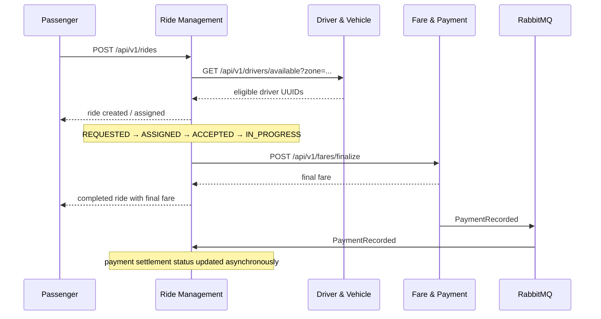

# Ride Booking and Payment Sequence

REST is used where Ride Management needs an immediate response. RabbitMQ is used for the settlement notification because it can be retried without blocking ride completion.
